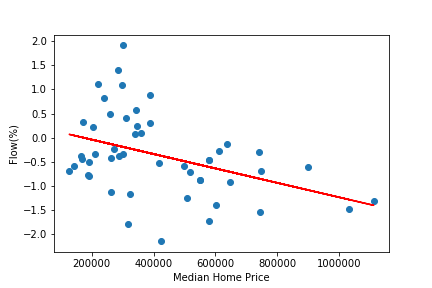

# SMUDS-Project-1

- HOW TO NAVIGATE THIS REPO: 
		○ input_data: shows input data
		○ output_data: shows output from the main file and plots.ipynb
		○ main.ipynb: gather and cleans data, and give output file for plots.ipynb
		○ plots.ipynb: visualize and give hypothesis testing and conclusions 
		
		
		
Research Description: Financial Prospects and Migration Flows 

- Members: Jin Dai, Michael Gonzales, Alex Ledger, Joseph McManus, Justin Boggs

- Are financial prospects of a county a significant driver of population inflows to that county?  

- Scope: Compare financial data for top 50 counties in the U.S. to population flows, to determine if there is a statistically significant relationship between the two. 

- Datasets to be used: 
		○ Financial: The financial data evaluated include Total Adjusted Gross Income, Median home price, Average Rent cost, Unemployment Rate, Highest Marginal Income Tax Rate. Data sourced from government and industry association sources. 
		○ Population flows: Migration data from the IRS 

- Tasks: 
		○ Find and aggregate migration flows data
		○ Find data and aggregate financial data
		○ Clean and organize data
		○ Run correlation and regression analyses to determine if any or all of financial data contributes to migration inflows
		

